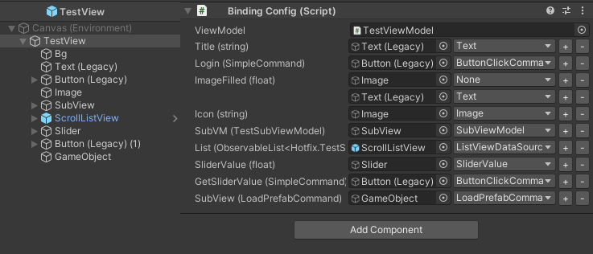

# UIBinding

Unity UGUI 绑定方案。

仅提供绑定方案，使用简单，扩展灵活。

[示例工程地址](https://github.com/zhzl/UIBindingDemo)

## 安装方法

1. 直接下载本项目放入工程。

2. 使用 Package Manager 安装，选择 Add packages from git URL，输入：https://gitee.com/zhzl/UIBinding.git 即可。

## 快速上手

1. 让你的窗口基类继承并实现 IBindingProvider，以下是示例工程代码：

``` csharp
using System;
using UIBinding;
using UnityEngine;

public abstract class UIView : IBindingProvider
{
    private BindingView bindingView;

    public virtual void OnInitialize(Transform transform)
    {
        bindingView = new BindingView();
        bindingView.InitDatabinding(transform, this);
    }

    public virtual void OnOpen() { }

    public T GetViewModel<T>() where T : ViewModelBase
    {
        return bindingView.GetViewModel<T>();
    }

    public ViewModelBase CreateViewModel(string viewModelName)
    {
        return (ViewModelBase)Activator.CreateInstance(Type.GetType(viewModelName));
    }

    public void LoadAssetAsync<T>(string path, Action<T> onComplete) where T : UnityEngine.Object
    {
        ResManager.LoadAssetAsync(path, onComplete);
    }
}

```

2. 创建窗口 ViewModel

``` csharp
using UIBinding;

public class TestViewModel : ViewModelBase
{
    [Notify] public string Title { get; set; }
    [Notify] public SimpleCommand Login { get; set; }
    [Notify] public float ImageFilled { get; set; }
    [Notify] public string Icon { get; set; }
    [Notify] public TestSubViewModel SubVM { get; set; }
    [Notify] public ObservableList<TestSubViewModel> List { get; set; }
    [Notify] public float SliderValue { get; set; }
    [Notify] public SimpleCommand GetSliderValue { get; set; }
    [Notify] public LoadPrefabCommand SubView { get; set; }
}
```

3. 在窗口预制根节点上挂载 BindingConfig 组件，并指定属性绑定关系



4. 在窗口逻辑内为 ViewModel 赋值，即可将数据同步到界面

``` csharp
public class TestView : UIView
{
    private int _count = 0;

    public override void OnOpen()
    {
        var vm = GetViewModel<TestViewModel>();
        vm.Title = "Test";
        vm.ImageFilled = 0.5f;
        vm.Login = new SimpleCommand(OnLoginClick);
        vm.SubVM = new TestSubViewModel
        {
            SubText = 666,
            SubImage = "UI/Test/Atlas/skill_quangangzou03",
        };

        vm.SliderValue = 0f;
        vm.GetSliderValue = new SimpleCommand(GetSliderValue);
    }

    ......
```
